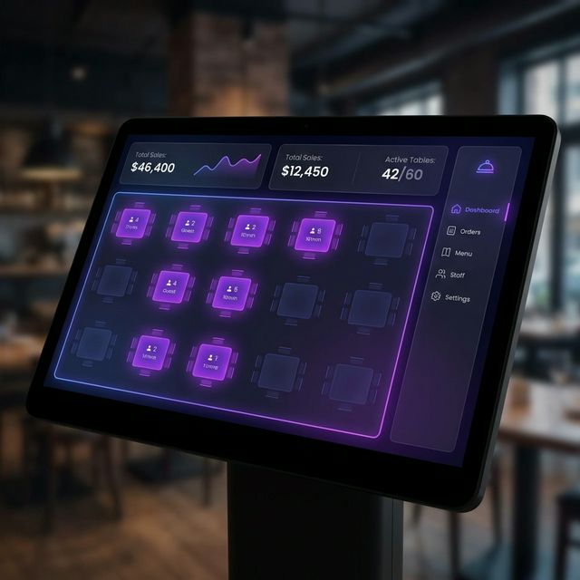

# Restaurant Billing & POS System



A modern, fast, and feature-rich Point of Sale (POS) and billing system designed specifically for restaurants. It features a stunning dark-mode interface, robust table management, and comprehensive order tracking.

## Features

- **Table Management**: Visual grid of all restaurant tables, color-coded based on occupancy.
- **Dynamic POS Flow**: Add items to an order categorized by type, complete with an efficient Search feature.
- **Order Tracking Updates**: Add new items to an existing `PENDING` order without creating duplicate orders.
- **Complete Checkout**: Select between "Cash" and "Online" payment methods to settle a table's bill.
- **Sales Dashboard**: Real-time sales insights showing today's revenue, occupied tables, completed orders, and a payment method breakdown.
- **Kitchen Order Tickets (KOT)**: Auto-generate printable tickets for the kitchen as soon as an order is placed.
- **Configurable Settings**: A dedicated admin panel to update restaurant details, currency locales, taxation logic, and manage menus.

## Technology Stack

- **Frontend/Backend**: [Next.js 15](https://nextjs.org/) (App Directory)
- **Styling**: Vanilla CSS (`globals.css`) with a sleek glassmorphism dark theme. No Tailwind dependencies.
- **Database**: MongoDB via the native Node.js `mongodb` driver.

## Getting Started

### Prerequisites

- Node.js (v18+)
- MongoDB connection string (Atlas or Local)

### 1. Database Configuration

Create a `.env.local` file at the root of the project:

```env
MONGODB_URI=mongodb+srv://<username>:<password>@cluster0.example.mongodb.net/restaurant_db?retryWrites=true&w=majority
```

### 2. Install & Start

```bash
npm install
npm run dev
```

The database schema will automatically initialize and seed standard settings and menu data on the first successful API connection.

Open [http://localhost:3000](http://localhost:3000) with your browser to launch the Table Dashboard.

## Accessing from Multiple Devices

This POS application is designed to be accessible across any device (tablets, mobiles, etc.) connected to your local network.

1. Find your host computer's Local IP Address (e.g. `192.168.1.50`).
2. Start the development server and bind it to all network interfaces:
   ```bash
   npm run dev -- -H 0.0.0.0
   ```
3. On your tablet or secondary device, open a web browser and navigate to `http://192.168.1.50:3000`.

## SRE & Operations Runbook

For detailed instructions on **Disaster Recovery, Database Backups, Troubleshooting, and Monitoring**, please read the [SRE Runbook](./SRE_RUNBOOK.md).

## Docker vs GitHub Deployment

**GitHub** is for storing and maintain your source code version history. It prevents data loss of your codebase and allows teams to collaborate. **Always use GitHub** for version control.

**Docker** is for containerizing the application so it is easy to deploy anywhere (like AWS, DigitalOcean, or an on-premise dedicated server) without manually installing Node.js and MySQL over and over again. **Use Docker** when you are ready to package the app for production deployment.

### Running with Docker

I have provided a `Dockerfile` and a `docker-compose.yml` file to make deployment fully automatic. The Compose file will automatically spin up a MySQL database for you, link it to the Next.js app, and start your production environment!

1. Make sure you have Docker installed on your host server.
2. In the terminal, run:

```bash
docker-compose up -d --build
```

3. Your app will now be running perpetually in the background at `http://YOUR_SERVER_IP:3000`!

## License

MIT
