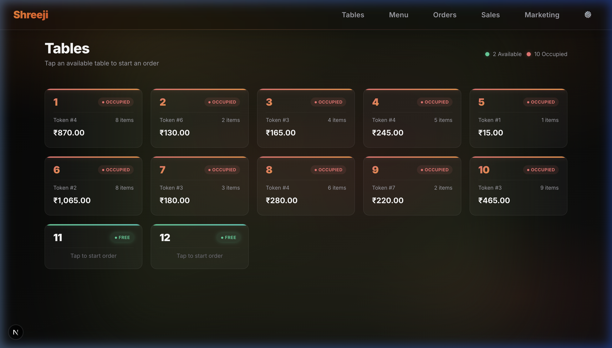
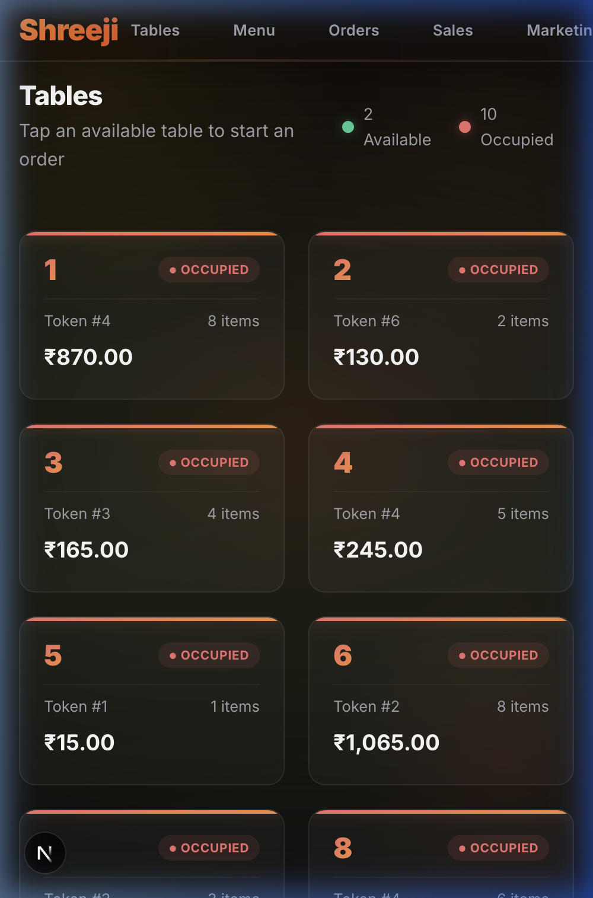

# Restaurant Billing & POS System

## System Overview

| Web Dashboard (Desktop) | Mobile App (Staff) |
| :---: | :---: |
|  |  |

A modern, fast, and feature-rich Point of Sale (POS) and billing system designed specifically for restaurants. It features a stunning dark-mode interface, robust table management, and comprehensive order tracking across both Web and Mobile platforms.

## Key Features

- **Dynamic Table Management**: Visual grid of all restaurant tables, color-coded based on occupancy (Available/Occupied).
- **Pro POS Flow**: Add items to an order categorized by type, complete with an efficient Search feature and real-time cart management.
- **Unpaid Dues / Credit Tracking**: Support for "Unpaid" payment mode, allowing you to track customer bills and settle them at a later date.
- **WhatsApp Marketing & CRM**: Integrated WhatsApp deep-links to send billing reminders or marketing messages directly to customers from the Sales Dashboard.
- **Direct Thermal Printing**: Optimized receipt printing for 80mm thermal printers (KOT and Customer Bills) with no browser redirection.
- **Mobile Companion App**: A native Flutter-based mobile application for staff to manage orders, tables, and sales on the go.
- **Comprehensive Sales Analytics**: Real-time dashboard showing Revenue (Today/Monthly), Pending Orders, and Payment Breakdown (Cash/Online/Unpaid).

## Technology Stack

### Web Application
- **Frontend/Backend**: [Next.js 15](https://nextjs.org/) (App Directory)
- **Styling**: Vanilla CSS (`globals.css`) with a sleek glassmorphism dark theme.
- **Database**: MongoDB via the native Node.js `mongodb` driver.

### Mobile Application
- **Framework**: [Flutter](https://flutter.dev/)
- **State Management**: Provider
- **Networking**: http (REST API)

## Getting Started (Web)

### 1. Database Configuration

Create a `.env.local` file at the root of the project:

```env
MONGODB_URI=mongodb+srv://<username>:<password>@cluster0.mongodb.net/restaurant_db?retryWrites=true&w=majority
```

### 2. Install & Start

```bash
npm install
npm run dev
```

Open [http://localhost:3000](http://localhost:3000) with your browser.

## Getting Started (Mobile)

The mobile app is located in the `/mobile` directory.

1. Install Flutter dependencies:
   ```bash
   cd mobile
   flutter pub get
   ```
2. Build the APK (Android):
   ```bash
   flutter build apk
   ```
3. **Important**: When running on a physical device, go to the **Settings** tab in the app and set the **Server IP** to your computer's local Wi-Fi IP address (e.g., `192.168.1.50`) to connect to the backend.

## SRE & Operations Runbook

For detailed instructions on **Disaster Recovery, Database Backups, Troubleshooting, and Monitoring**, please read the [SRE Runbook](./SRE_RUNBOOK.md).

## Deployment

### GitHub
Always use GitHub for version control and source code history.

### Docker (Production)
The application includes a `Dockerfile` and `docker-compose.yml` for automated production deployment.

```bash
docker-compose up -d --build
```

Your app will be running at `http://YOUR_SERVER_IP:3000`.

## License

MIT
