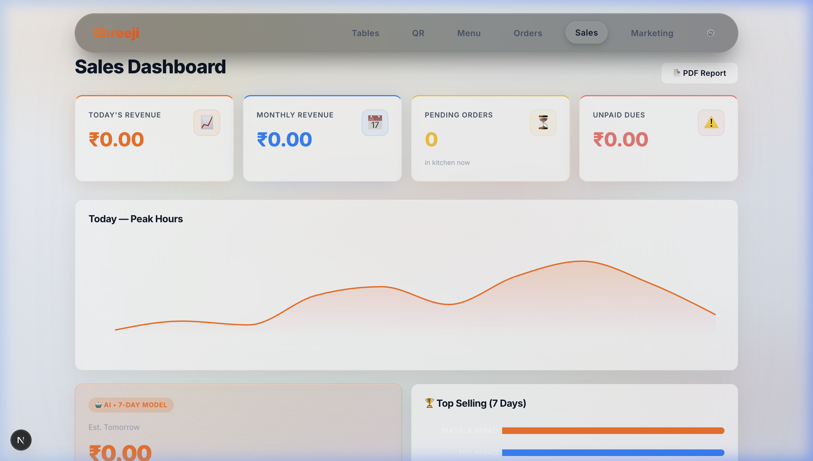
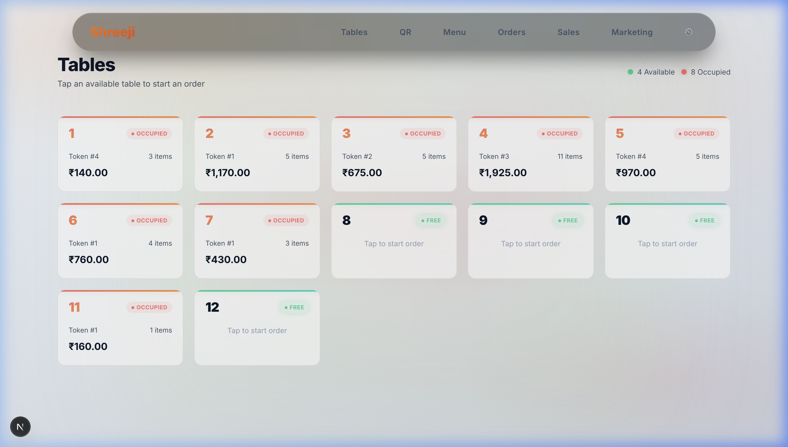
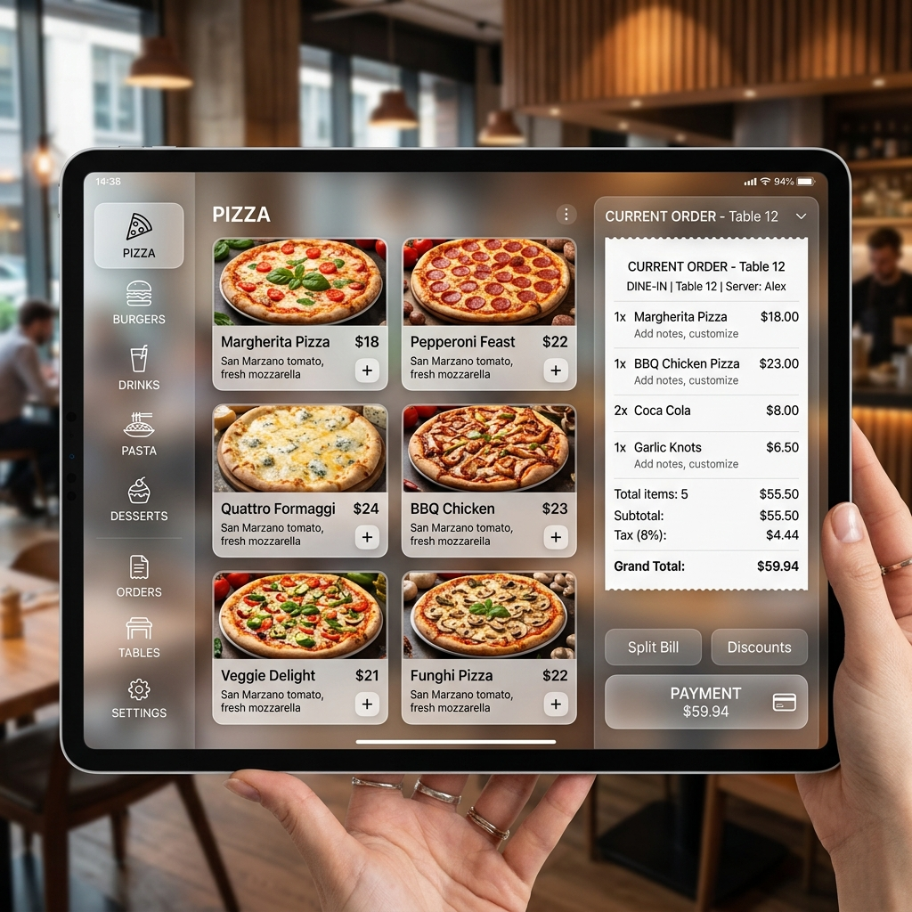
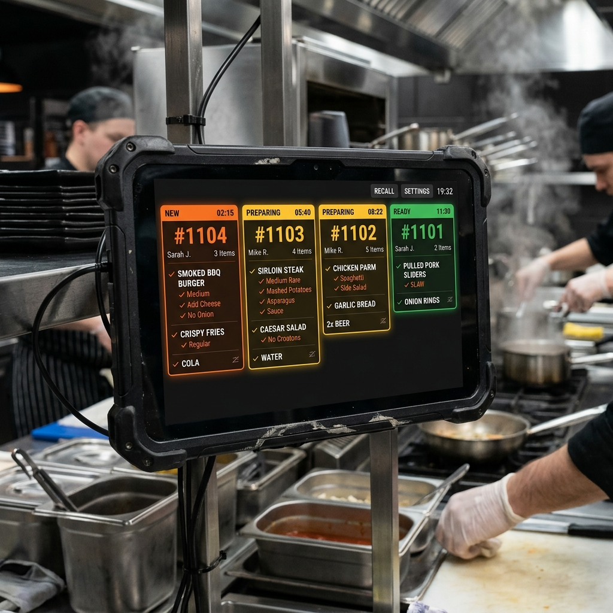
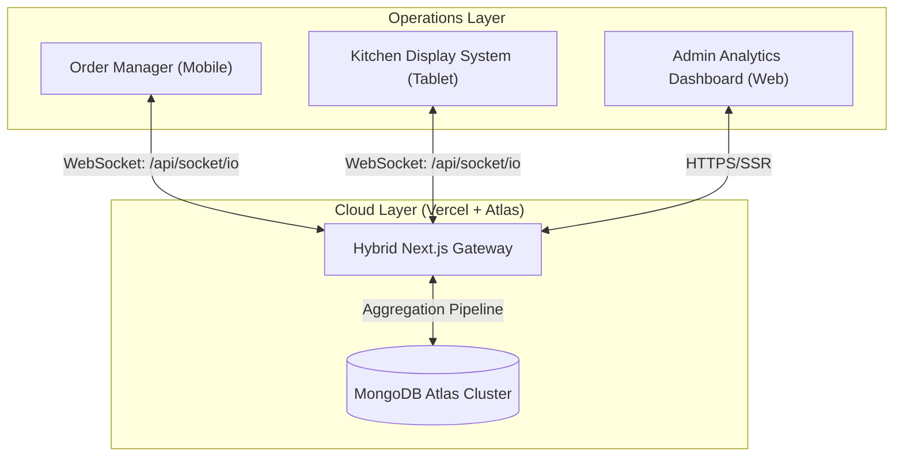

# 🚀 NEXUS POS: Frontier Restaurant Engine

## High-Performance, Real-time Operational Ecosystem

[](https://nextjs.org)
[](https://socket.io)
[](https://vercel.com)

Nexus POS is a **distributed, low-latency ecosystem** engineered for high-throughput restaurant environments. It represents a paradigm shift from traditional polling-based ERPs to a **Reactive Event-Driven Architecture (REDA)**, ensuring sub-100ms synchronization across the entire operational floor.

---

## 📸 Technical Showcase

### 1. Real-time Dashboard (Web)
*Captured from live production environment*

> **Engineering Insight**: This dashboard utilizes a single-trip MongoDB `$facet` aggregation to deliver 12+ financial KPIs (Today's Revenue, Hourly Trends, AI Projections) in <100ms.

### 2. High-Density Tables View (Real-time Operations)

> **Engineering Insight**: Every table card is a reactive node. State changes (Occupied -> Paid) are pushed via WebSocket to all connected mobile and web clients instantly.

### 3. Frontier UI Concepts (Mobile & KDS)
| POS Terminal (Mobile) | Kitchen Display (Tablet) |
| :---: | :---: |
|  |  |
| *High-frequency cart management* | *Ruggedized preparation workflow* |

---

## 🏛️ System Architecture


```mermaid
graph TD
    subgraph "Cloud Layer (Vercel + Atlas)"
        WebGate["Hybrid Next.js Gateway"]
        DB[(MongoDB Atlas Cluster)]
    end

    subgraph "Operations Layer"
        KDS["Kitchen Display System (Tablet)"]
        POS["Order Manager (Mobile)"]
        Admin["Admin Analytics Dashboard (Web)"]
    end

    POS <-->|WebSocket: /api/socket/io| WebGate
    KDS <-->|WebSocket: /api/socket/io| WebGate
    Admin <-->|HTTPS/SSR| WebGate
    WebGate <-->|Aggregation Pipeline| DB
```

---

## 🔬 Deep-Dive: Technical Internals

### 1. Reactive Analytics Pipeline
At the heart of the "Sales Dashboard" is a complex MongoDB aggregation engine. Instead of multiple queries, we use a single `$facet` pipeline to minimize RTT (Round Trip Time).

```javascript
// lib/db/tables.ts - Dashboard Aggregation
db.collection('orders').aggregate([
  {
    $facet: {
      todayStats: [
        { $match: { createdAt: { $gte: todayStart } } },
        { $group: { _id: null, revenue: { $sum: { $cond: [{ $eq: ['$status', 'PAID'] }, '$total', 0] } } } }
      ],
      hourlyTrends: [ /* ... hourly buckets ... */ ],
      topSellers: [ /* ... sort by qty ... */ ]
    }
  }
])
```

### 2. WebSocket State Machine
Nexus POS uses a unidirectional event bus to maintain state consistency across the network.

*   **`ORDER_UPDATED`**: Broadcasted when an item is added, status changes, or payments are processed.
*   **Payload Schema**:
    ```json
    {
      "orderId": 451,
      "type": "CREATED | ITEMS_ADDED | STATUS_UPDATED",
      "status": "PENDING | PAID",
      "tableNumber": 12
    }
    ```

### 3. Flutter Rendering GPU Optimization
To achieve 60fps on low-end ARM chipsets, the mobile app employs **Repaint Boundary Isolation**. By wrapping volatile UI clusters (like a ticking kitchen timer or a sliding cart) in a `RepaintBoundary`, we prevent the entire widget tree from re-rasterizing on every frame.

---

## 📂 Project Anatomy

```text
├── app/                 # Next.js 15 App Router (Dashboards & API)
├── components/          # Reusable UI (Radix based)
├── lib/                 # Core Business Logic
│   ├── db/              # MongoDB Domain Logic (Menu, Orders, CRM)
│   ├── socket.ts        # WebSocket Gateway implementation
│   └── whatsapp.ts      # Intent-based deep-linking engine
├── mobile/              # Flutter Native Application
│   ├── lib/services/    # Real-time state management (Socket.io-client)
│   └── lib/screens/     # Optimized 60fps UI screens
└── SRE_RUNBOOK.md       # Operational & Disaster Recovery guide
```

---

## 🛠️ Infrastructure & Setup

### API & Dashboard (Web)
1. **Env**: Set `MONGODB_URI` in `.env.local`.
2. **Execute**: `npm install && npm run dev`.

### Mobility Fleet (Flutter)
1. **Env**: Update `mobile/.env` with `API_BASE_URL`.
2. **Run**: `cd mobile && flutter run --release`.

---

## 📜 Dev Manifesto
This project adheres to **"Mechanical Sympathy"**. Every byte counts. Every frame matters.

**Nexus POS — Built for the Grind.**
